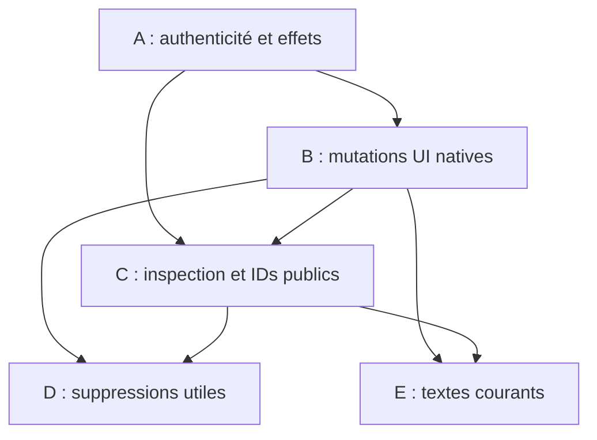

EXPERT ADVISORY
Date: 2026-10-04
Base main: 76d43378b214a974a4a43630e4d4d37dc95a929b
Scope: Full repository cleanup, coherence and code-quality audit after R6
Status: ADVISORY — NOT ROADMAP AUTHORITY

## 1. Executive findings

R6 est intégré : les sept capacités retenues sont présentes, les dix outils MCP v2 restent la surface publique, et aucune PR d'implémentation n'est ouverte à la date de cette inspection. Cela ne valide pas encore une release du code exact audité. La suite locale passe, mais plusieurs fixtures reproduisent les attentes de Gia plutôt que les effets natifs Grist.

Cet audit définit **16 actions finies : 4 BLOCKING BEFORE NEXT RELEASE, 9 SHOULD FIX BEFORE NEXT RELEASE et 3 CLEANUP WORTH DOING**. Il ne crée ni fonctionnalité, ni roadmap, ni obligation de réaliser les nettoyages facultatifs avant une release. Les décisions KEEP / HISTORICAL ONLY / NO ACTION sont explicites plus bas.

Les quatre blocages sont : le mauvais décodage du résultat natif de création d'un summary ; l'interaction fields → Card layout qui refuse un état produit par Gia ; la perte des informations typées après écriture C1/C8 à la frontière MCP ; et l'acceptation de JWT signés dont la validité temporelle ou les paramètres JOSE sont incompatibles avec leur utilisation. Les trois premiers confirment B1–B3 du rapport Expert précédent ; le quatrième résulte de la revue transversale de l'authentification.

La séparation principale des autorités reste satisfaisante : un grant n'emprunte pas la capacité d'un autre pour autoriser une même ressource, un accès document ne donne pas autorité workspace, C1 exige une preuve Owner native fraîche, et C8 conserve une seule identité Grist sans étendre automatiquement ses grants. Aucun endpoint public d'actions Grist arbitraires, changement automatique de credential après refus, moteur ACL local ou rejeu automatique d'une création n'a été trouvé.

Le nettoyage utile est limité. Il existe des métadonnées et helpers v1 devenus sans consommateur runtime, deux exécuteurs de batches équivalents et deux mappings stricts de colonnes identiques. Les normalizers Card/page, les contraintes ACL, les contrôles de contexte/principal et les preuves R4/R5 ont encore une raison d'exister. Une réécriture générale du service, un normalizer universel ou une nouvelle campagne applicative n'aideraient pas à résoudre les causes constatées.

## 2. Current-state facts

### 2.1 Snapshot GitHub et limites de l'exécution

| Élément | Fait observé |
| --- | --- |
| Dépôt et base | `djibian/gia`, `main` = `76d43378b214a974a4a43630e4d4d37dc95a929b`, tree = `57b3458d3937dc188f27611f85b9e730a0d3c200` |
| Dernier commit | `Expert: Post-R6 integrated release readiness (#213)`, 2026-10-04 ; parent = `04f6cde3e07903ce1f4143ad1068356daf612365` |
| PR ouvertes avant ce rapport | Aucune ; donc aucun HEAD d'implémentation concurrent à analyser |
| Issue ouverte | #58, distribution publique/revue OpenAI optionnelle, explicitement DEFERRED ; ce rapport ne la réactive pas |
| Version | Package/serveur `0.6.0` ; contrat MCP `2`, versionné séparément |
| Release publiée | `v0.6.0`, cible `22cc202c717786d4d8a94f992ccb7aeaae9f8c13`, publiée le 2026-10-01 ; elle ne contient pas toute l'intégration R6 |
| CI de la base exacte | Job `verify` réussi : [run 37228010525](https://github.com/djibian/gia/actions/runs/37228010525/job/111511588886) |
| Modifications de cet Expert | Uniquement ce nouveau rapport ; aucun changement des fichiers existants, aucun patch, aucune release, aucune campagne avec application réelle |

Les anciennes branches distantes de documentation, POC, sécurité et widget configuration ne sont pas des PR ouvertes ni du travail R6 restant. Leur suppression administrative n'est pas une action de cet audit.

| Intégration récente pertinente | PR | Commit intégré |
| --- | --- | --- |
| C2 fields/order/width | #202 | `e5d7d7f3f4146aa5ec7893be1b3e37594fd1eb33` |
| C4 persistent filters | #206 | `01517d731c738a0eabd64370b5e46bb84b2bfec7` |
| C3 native summaries | #207 | `4383a6b0f4ad3995c4bb77c0327169860674ca58` |
| C5 Card/Card List layout | #209 | `ec513d14b077925e700c25840e10bdff82587cef` |
| C10 page order | #210 | `bcdc13722acbef0e82a8b0f60843d3f05f29cdb2` |
| C1 application ACL | #211 | `cef0d0d03512837ce5d57afca9485d83153857eb` |
| C8 document bootstrap | #212 | `04f6cde3e07903ce1f4143ad1068356daf612365` |
| Expert release readiness | #213 | Base de ce rapport ; seul ajout documentaire depuis C8 |

### 2.2 Inventaire couvert

La revue a porté sur les **52 fichiers TypeScript de `src/`, les 76 fichiers de tests actifs, les 14 fichiers TypeScript de `tools/`**, les configurations et scripts du dépôt, et l'inventaire des **90 documents Markdown de `docs/` avant ce rapport**. Les guides R6, les textes normatifs et les deux rapports Expert ont été lus ; les autres documents ont été examinés selon leur statut et leurs affirmations encore utilisées. Aucune conclusion ne dépend de mémoire de conversation.

| Famille runtime | Fichiers examinés dans `src/` | Conclusion dominante |
| --- | --- | --- |
| Entrée/config/version | `server.ts`, `config.ts`, `version.ts`, `openaiAppsChallenge.ts` | Surface fermée ; challenge conditionnel actif, dérive documentaire |
| Authentification/autorisation | `auth/{authorizationService,jwksAccessTokenVerifier,oauthAccessToken,oauthPrincipal,oauthProtectedResource,oauthRequestContext,principal,staticBearer}.ts` | Grants/contexte corrects ; validation JWT à durcir |
| Client/autorité Grist | `grist/{client,service,authorizedService,accessPolicy,credentials,contextFactory}.ts` | Pas de fallback d'identité ; effets/batches et résultat rename à traiter |
| Inspection | `grist/{documentContext,documentUi,formulaInspector,publicMetadata,selectByContext}.ts` | Minimise les tables/formules ; projections UI inégales |
| Adaptation UI | `grist/{uiActionsAdapter,chartTypes,customWidgetSettings,customWidgetSettingsUpdate,gridOptions,pageLayout,pageOrder,selectBy,widgetFields,widgetFilters,widgetSort}.ts` | Read/write/re-read justifiés ; quatre interactions/bornes à corriger |
| R6 spécialisé | `grist/{accessRules,cardLayout,summaryTables}.ts` | Subsets bornés conservés ; summary/Card/erreurs nécessitent réparation |
| MCP | `mcp/{leanRegistry,leanTools,oauthToolChallenge,oauthToolSecurity,outputSchemas,results}.ts` | Dix tools réels ; scopes par action et sortie publique à réconcilier ; schemas dormant |
| Registry/help/annotations | `operations/{registry,progressiveHelp,schemaMutationContract,submissionAnnotations}.ts` | Mapping d'autorisation et schemas Zod utiles ; anciens exports/help supprimables |
| Audit/ops | `audit/auditLogger.ts`, `ops/{operationalEvents,principalRateLimiter}.ts` | Événements bornés, pas de payload/token journalisé ; KEEP |
| POC compatibility | `compat/{logtoMcp,proconnectMcp}.ts` | Utilisés seulement par POC/tests ; pas par `server.ts` |

Les cinq dépendances runtime (`@modelcontextprotocol/express`, `/node`, `/server`, `express`, `zod`) et les quatre dépendances de développement ont un usage actuel. Aucun retrait de dépendance n'est justifié. Les `tsconfig`, `tsconfig.poc-tools.json`, trois workflows CI, `package-lock.json`, `.env.example`, fichiers d'infrastructure POC, artefacts de soumission et textes racine README/SUPPORT/PRIVACY/TERMS/LICENSE ont été examinés. Le check outils ne couvre qu'une sélection de huit outils ; les scripts R4 sont aussi exercés dans leurs workflows propres. Cela ne constitue pas, à lui seul, un défaut à transformer en nouveau framework.

### 2.3 Contrat réel des dix outils

| Tool MCP | Capacité de base | Invariant et exception actuels |
| --- | --- | --- |
| `grist_discover` | `doc:read` | Discovery filtrée par principal ; workspaces C8 ne se déduisent pas des documents |
| `grist_inspect` | `doc:read` | Inspection bornée ; C1 ajoute une preuve Owner avant lecture des ACL privées |
| `grist_query` | `doc:read` | Données natives ; pas d'évaluation de politique par Gia |
| `grist_add_records` | `doc:write` | Résultats de créations minimisés ; effets confirmés/partiels conservés |
| `grist_change_records` | `doc:write` | Modifications/destructions explicites et bornées |
| `grist_add_structure` | `doc.schema:write` | C8 exige autorité workspace explicite ; copy-as-template exige aussi `doc:read` sur la source |
| `grist_change_structure` | `doc.schema:write` | C1 exige Owner frais ; aucun texte ACL arbitraire |
| `grist_add_ui` | `doc.schema:write` | Primitives privées fixes ; C3 natif, aucun `/apply` public |
| `grist_change_ui` | `doc.schema:write` | Remplacement/patch borné, vérification selon la mutation |
| `grist_help` | Aucune ressource | Catalogue compact des dix tools ; ancien progressive help non branché |

Les annotations restent quatre tools readonly, trois additifs, trois destructifs. Les unions/actions et schemas d'entrée fermés n'offrent pas d'UserActions arbitraires. Le runtime utilise `textResult` ; les anciens `outputSchemas` ne sont pas enregistrés comme output schemas des tools v2. Ne pas confondre leur validation dans des tests avec une garantie de la frontière MCP active.

### 2.4 Vérification réalisée

| Vérification sur la base exacte | Résultat / limite |
| --- | --- |
| `npm ci --ignore-scripts` | Réussi ; fichiers suivis inchangés |
| `npm run check` | Réussi |
| `npm test` puis équivalent sans CLI IPC | Le lanceur `tsx` échoue localement sur la création de pipe `/tmp` (`EPERM`). `node --import tsx --test test/*.test.ts` exécute la même suite : **318/318 réussis, aucun skip** |
| `npm run build` | Réussi |
| `npm audit --omit=dev --audit-level=high` | Zéro vulnérabilité production connue dans le lock courant |
| Environnement local | Node `24.19.0` ; CI Node 22. L'équivalence locale du lanceur n'est pas une qualification de déploiement |
| Vérifications ciblées éphémères | JWT signés avec `nbf` futur, `crit` inconnu, clé EC/signature ECDSA sous header RS256 sans `alg` dans le JWK, et RSA-1024 sous RS256 : acceptés. Merge C4 de 200 filtres + 1 : plan de 201. Page layout avec clé native inconnue : normalisé sans marqueur incomplete |

Les vérifications ciblées utilisaient des clés et métadonnées synthétiques locales ; aucun token/secret de déploiement, application réelle ou fichier de test nouveau. Les suites vertes ne réfutent donc pas les contre-exemples identifiés. Les corrections futures doivent vérifier ces invariants précis, sans objectif de couverture chiffrée.

## 3. Upstream/reference findings

Source Grist observée au commit **`72345cbe06cad2ddeee4a9db1e133d82f1fd2294`**. Il s'agit d'une observation de source privée/native, pas d'une promesse REST stable ni d'une qualification de toutes les versions Community. Les workflows R4 existants couvrent 1.7.16–1.7.19 pour leurs scénarios historiques ; ils ne qualifient pas les sept nouveaux chemins R6.

| Référence | Fait externe observé | Conséquence pour Gia |
| --- | --- | --- |
| `sandbox/grist/useractions.py`, `CreateViewSection` | Le retour `tableRef` désigne la table source fournie à l'action ; le `sectionRef` créé désigne la section dont la table peut être un summary différent | CODE-01 : résoudre la table créée depuis la section relue, sans inventer un retour natif différent |
| Même fichier, `_removeViewSectionFieldRecords` ; `RecordLayout.js`, `updateLayoutSpecWithFields` | Supprimer un field ne réécrit pas le layout Card persisté ; le client retire les feuilles obsolètes dans une représentation dérivée | CODE-02 : distinguer obsolescence native attendue et corruption inconnue ; ne pas importer le moteur de layout navigateur |
| Même fichier, `RenameColumn` / `_pick_col_name` | Le moteur normalise/déduplique le nom et renvoie le `colId` réellement obtenu | CODE-05 : un echo du nom demandé n'est pas l'ID public résultant |
| `DocModel.ts`, `menuPages` / `visibleDocPages` ; `PageRec.ts` | Navigation et pages individuellement visibles sont deux ensembles distincts : la navigation masque aussi les descendants d'un parent censuré ; pages spéciales séparées | COHERENCE-02 : l'inspection doit permettre le set C10 exact ; ne pas rendre identiques les guards de suppression et d'ordre |
| `app/common/BoxSpec.ts` | Forme native explicitement bornée par des clés connues, `collapsed` à la racine ; Card et page ne sont pas un seul contrat public | CODE-06 : ne pas déclarer complet un arbre dont Gia ignore un attribut qu'elle écrasera |
| RFC 7519 §4.1.5 | `nbf` est optionnel, mais un JWT qui le contient ne doit pas être accepté avant cette date | SECURITY-02 : vérifier le claim s'il existe, sans rendre `nbf` obligatoire |
| RFC 7515 §4.1.11 ; RFC 7518 §3 | Les extensions critiques inconnues doivent invalider le JWS ; l'algorithme annoncé doit correspondre à la famille/paramètres de clé, notamment RSA d'au moins 2048 bits pour RS/PS | SECURITY-02 : vérifier les contraintes JOSE avant d'établir un principal |

Les conclusions natives C1/C8 du rapport antérieur restent applicables : Grist enforce les droits effectifs avec le credential sélectionné ; une vérification de metadata ACL ne prouve pas la confidentialité ; template n'est pas une opération de nettoyage de secrets/configuration ; permissions natives de copie et héritage destination restent les oracles. Aucun écosystème supplémentaire n'est nécessaire pour cet audit de nettoyage. La provenance et les dispositions de réutilisation figurent en section 10.

## 4. Risk and invariant analysis

### 4.1 Chaîne transversale d'autorité

| Frontière | État à la base exacte | Preuve / limite / action |
| --- | --- | --- |
| OAuth principal | Signature asymétrique, issuer/audience/expiration et mapping des scopes contrôlés ; claims JOSE/`nbf` insuffisants | SECURITY-02 ; pas de preuve de forge sans clé de confiance |
| Resource grant → capability | `authorizationService` exige la capacité dans un grant qui couvre la ressource ; workspace C8 vérifié dans le même grant | KEEP ; ne pas réunir les capabilities de deux grants pour rendre un workspace éligible |
| Deployment ceiling | `accessPolicy` ajoute les plafonds explicitement configurés ; un ID nouvellement créé ne les élargit pas | KEEP ; resource URL/ID ne constitue pas un grant |
| Credential sélectionné | `contextFactory` produit un contexte associé au principal et à son credential Grist ; aucune sélection d'identité secondaire après refus | KEEP ; discovery cache local au contexte, TTL borné |
| Autorité native | Owner C1 relu, endpoints C8 sous même credential ; read/write natives restent décisifs | KEEP ; pas de Master/org authority, pas de simulation d'ACL pour autoriser |
| Opération bornée | `doc:write` pour données ; `doc.schema:write` pour schéma/UI/policy/bootstrap ; fixed actions privées | KEEP ; aucun passthrough `/apply` public |
| Read-modify-write | C2/C4/custom/Grid/C1 préservent l'état non ciblé et relisent ; C10 simule la hiérarchie avant write | CODE-02/03/06 ; pas de CAS garanti, pas de restauration automatique d'un ancien état |
| Partial/uncertain | Data batches distinguent succès confirmé, échec certain et résultat inconnu ; pas de retry automatique | SECURITY-01 complète le dernier maillon C1/C8 ; conserver les IDs d'effets connus |
| Cache/invalidation | C8 invalide discovery même en sortie d'erreur après tentative ; nouvelle autorisation à la découverte suivante | KEEP ; aucun oubli d'invalidation démontré dans les chemins audités |
| Sortie vers le modèle | Tables/formules et metadata custom normalisées minimisées, mais certains objets UI bruts transitent encore | SECURITY-03 et CODE-04 ; aucune clé API réelle trouvée dans une réponse de cet audit |

Une ACL sauvegardée n'est jamais utilisée comme preuve locale d'enforcement. C1 retourne `effectiveEnforcementVerified: false`. L'accès structure/formules et les defaults natifs peuvent limiter une intention de confidentialité ; conserver cette limite et l'expliquer au client. La concurrence humaine pendant une mutation reste sans CAS ; les checks de postcondition réduisent le risque mais ne l'annulent pas.

### 4.2 Cohérence des sept capacités R6

| Capacité | Chemin réel et préservation | Écart utile / décision |
| --- | --- | --- |
| C2 fields/order/width | `widgetFields` mappe colIds → refs privées, garde les metadata des fields conservés, bornes 0–200 / 1–2000px, vérifie le résultat | CODE-02 interaction Card ; CLEAN-03 mapping strict commun avec C4 |
| C4 persistent filters | Patch ciblé par colId ; valeurs scalaires bornées, pinning/options non ciblés conservés ; filtre ≠ ACL | CODE-03 borne sur l'état final ; pas de moteur de filtre/ACL commun |
| C3 native summaries | Group-by sur source stable, action native, summary metadata relues ; table dérivée indépendante pour ACL | CODE-01 retour natif ; ne pas créer de générateur de tables/formules Gia |
| C5 Card/Card List | Arbre sur fields actuellement visibles ; refs de fields privées ; tous les fields doivent être représentés | CODE-02 obsolescence native, CODE-04 compact context, SECURITY-03 raw layout |
| C10 navigation | Snapshot borné, positions non ciblées conservées, simulation de parentage/visibilité, post-read exact | COHERENCE-02 inspection ; ne pas fusionner navigation et visibilité individuelle |
| C1 application ACL | Subset roles/table CRUD/column RU, defaults/`S`/memos/opaque/user attributes conservés, Owner frais | SECURITY-01 projection des échecs ; restrictions finales justifiées, pas de nouveau policy DSL |
| C8 create/template | Workspace explicite dans grant/plafond, source read séparée, template fixe, même credential, membership re-check | SECURITY-01 effets connus, COHERENCE-01 metadata OAuth ; pas de copie intégrale/auto-grant |

Les patterns de re-read sont semblables mais leurs postconditions ne le sont pas : ACL vérifie aussi un fingerprint non ciblé ; C8 vérifie destination et identité d'un document ; C2 gère la survie des fields ; C10 vérifie parentage et visibilité. **KEEP** ces différences. Le seul partage de normalizer proposé concerne deux fonctions strictement équivalentes (CLEAN-03). Aucun adapter universel write/re-read n'est recommandé.

### 4.3 Applicabilité des précédents rapports Expert

| Rapport | Applicabilité | Conclusions toujours satisfaites ou restant à traiter |
| --- | --- | --- |
| `2026-10-04-r6-acl-document-boundaries-f0da0c8.md` | **PARTIALLY STALE** | C1/C8 ne sont plus pending ; les alternatives non retenues sont historiques. Même-grant workspace, source read distincte, credential unique, Owner frais, preservation ACL, IDs privés en entrée, limites d'enforcement, template fixe et absence de replay/auto-grant sont satisfaits. La conservation des effets C1/C8 à la frontière MCP reste incomplète (SECURITY-01). Le refus global de stale Card leaves doit être raffiné (CODE-02). L'option source-Owner supplémentaire n'était pas une exigence : ne pas l'ajouter. |
| `2026-10-04-post-r6-release-readiness-04f6cde.md` | **CURRENT** | Le seul changement intervenu est ce rapport #213. B1 = CODE-01, B2 = CODE-02, B3 = SECURITY-01, S1 = COHERENCE-01, S2/S4 = DOC-01 restent ouverts. S3 reste une limite de preuve native : aucune qualification R6 nouvelle n'a été réalisée ici. Les analyses d'autorité satisfaites restent valides. |

Ce rapport étend l'audit à tout le produit et remplace l'énumération de nettoyage pour ce scope. Il ne réécrit ni n'efface les rapports antérieurs et ne transforme pas leurs options historiques en exigences.

### 4.4 Chaîne documentaire et classification

| Niveau / fichiers | Contradiction ou état observé | Disposition finie |
| --- | --- | --- |
| Runtime → MCP, `MCP-CONTRACT.md` | Dix tools conformes ; erreurs R6, scopes C8, compact Card et données UI brutes divergent. C8 emploie une fois source `documentId` au lieu de l'entrée réelle `sourceDocumentId`. La compatibilité raw `layoutSpec` C5 est explicitement promise | CODE/SECURITY/COHERENCE ci-dessous ; DOC-01 ; décision de contrat SECURITY-03 avant retrait d'un champ promis |
| `ROADMAP.md` | Overview encore R6 ACTIVE / R6.3 ELIGIBLE, alors que détail marque les sept capacités DONE et aucune sélection restante | DOC-01 : projection d'état, aucune nouvelle éligibilité ni R7 |
| `ARCHITECTURE.md` | Introduction actualisée, références au « R3 candidate » encore présentées comme courantes ; séparation private/public plus stricte que certaines sorties | DOC-01 et SECURITY-03 ; préserver la structure normative utile |
| `SECURITY.md` | Affirme que la route OpenAI challenge historique n'est pas dans le candidat ; le runtime expose conditionnellement `/.well-known/openai-apps-challenge` si configuré | DOC-01 : préciser l'exception actuelle non model-facing ; ne pas supprimer cette route par principe |
| `PRODUCT_VISION.md` | Frontière client/Gia/Grist et exclusions cohérentes avec le subset final ; aucune raison de réécrire la vision | KEEP ; le rapport ne modifie pas la direction produit |
| `README.md` | « Current candidate » R3 et ancienne formulation générique d'exclusion ACL coexistantes avec C1/C8 intégrés ; ancien futur de validation R4 | DOC-01 : état courant R6, administration identité/partage générale toujours exclue |
| Sept `R6-C*.md` | C1/C5/C10/C8 « implementation candidate », C2 mentionne encore le prochain C4 ; C3 décrit le mauvais retour summary ; C10 annonce absence de pagePos privé malgré sorties brutes | DOC-01 après réparations ; conserver les preuves/PR et les limites de native qualification |
| `OAUTH-OPERATIONS.md`, `CHATGPT-OAUTH-READINESS.md` | Fin du runbook encore R5-D next eligible ; assertion d'une seule capability par tool ne couvre pas l'action C8 copy | DOC-01 avec COHERENCE-01 ; gardes de deployment et recovery actuels KEEP |
| `USER-CONTEXT.md`, `C5-DECISION.md` | Ancienne description de deux contexts MCP/GPT Actions et OAuth futur ; ancienne décision de blocage credentials | HISTORICAL ONLY : marquer l'ancien état et pointer le contexte OAuth courant, sans modifier le raisonnement/proof ancien |
| `TERMS.md` | Exclusion générale « Grist ACL administration » trop large face au subset C1 désormais décrit | DOC-01 : qualifier l'administration générale ; pas de changement des engagements juridiques non techniques |
| `PRIVACY.md`, `SUPPORT.md`, `LICENSE` | Pas d'incohérence produit supplémentaire démontrée ; rétention effective déployée non vérifiable par ce dépôt | KEEP / NO ACTION ; aucune nouvelle analyse juridique ou campagne de conformité |
| P0/P1/P2/P3/P4/Q0, M1–M3, retrospective/recomposition, `UPSTREAM-GRIST.md` | Preuves/préparation datées, non inventaire du runtime actuel | HISTORICAL ONLY ; garder dates/base/résultats, ne pas certifier R6 par ces documents |
| `LOGTO-*`, `PROCONNECT-*`, infra POC, `OAUTH-IDP-DECISION.md` | Exploration d'IdP et preuves POC ; implémentation product OAuth désormais différente | HISTORICAL ONLY ; ne pas présenter les probes POC comme qualification du produit |
| `GPT-ACTIONS.md`, `EXECUTION-ENGINE-J0-J1.md`, tous `J1-*`/`J2-*`, behavioural/stage-tracking/delta | Contrats retirés, journal/domaine/browser/proof historiques | KEEP comme preuves historiques ; aucun retour du journal, GPT Actions ou application verticale |
| `R0-*` à `R3-*`, compact/minimization/plugin-ready audits | Inventaires/décisions à leur ancien SHA ; certains constatent déjà des compatibilités raw UI | KEEP / HISTORICAL ONLY ; pas de mise à jour rétroactive de leurs résultats |
| Tous `R4-*`, workflows/probes R4 | Preuve historique plus tests synthétiques/compatibility encore actifs et utiles | KEEP ; limites de couverture explicites, ne pas relancer la campagne ni agrandir la matrice |
| Tous `R5-*`, OpenAI reviewer/submission docs et artefacts | Preuves live datées et ancienne préparation de distribution ; #58 reste DEFERRED | KEEP / HISTORICAL ONLY ; les scénarios négatifs d'administration générale restent utiles ; aucun dépôt/revue publique lancé |
| `R6-ECOSYSTEM-DELTA-REVIEW`, `R6-PRODUCT-CAPABILITY-REVIEW`, `R6-PARETO-GAP-SELECTION` | Décisions qui expliquent les sept capacités retenues, pas nouvelle liste de travaux | KEEP ; les autres capacités non retenues restent hors scope |
| `CREDENTIALS.md`, `OPERATIONS-OBSERVABILITY.md`, protocoles/prompts/AGENTS | Instructions actuelles utiles ; détail d'ancien transport ailleurs ne les remplace pas | KEEP ; gouvernance inchangée par cet Expert |
| `docs/expert/*` | Evidence consultative sur bases exactes, avec staleness triggers | KEEP immuable ; seule cette nouvelle analyse est ajoutée |

Cette classification couvre les familles de l'inventaire documentaire ; elle n'ordonne pas de déplacer ou retoucher les 90 documents. Le correctif DOC-01 vise les assertions courantes nommées. Les preuves déjà datées et clairement historiques restent en place. Aucune suppression de preuve n'est recommandée pour sa seule ancienneté.

## 5. Options considered

| Option | Décision / raison |
| --- | --- |
| Se fier aux 318 tests et déclarer le dépôt prêt | REJECT : retours natifs et états produits par Gia fournissent des contre-exemples concrets |
| Réparer les seams nommés, enlever seulement le code sans consommateur et réconcilier les projections | Option minimale recommandée ; conserve les fonctionnalités et limites actuelles |
| Nouveau service générique mutation/normalization, nouvelles classes ou registry universelle | REJECT : les invariants et effets sont différents ; aucune suppression nette de complexité démontrée |
| Un exécuteur de batches et un helper strict de mapping C2/C4 | ADAPT : supprimer deux duplications réelles, sans changer le modèle ni ajouter de cache |
| Réécrire entièrement `authorizedService`/`leanTools` pour leur longueur | REJECT : taille seule insuffisante ; opérations explicites et frontières dangereuses plus faciles à auditer ainsi |
| Supprimer les dossiers/documents R4/R5/J1/J2 parce qu'anciens | REJECT : preuve historique utile et, pour R4, regressions encore actives ; marquage ciblé seulement |
| Supprimer silencieusement toutes les anciennes sorties raw v2 | REJECT : certaines sont promises ; SECURITY-03 doit traiter explicitement la compatibilité et la minimisation |
| Ajouter une bibliothèque JWT, une introspection ou un nouveau flow de login pour SECURITY-02 | NO ACTION NOW : les validations bornées manquantes suffisent ; aucun remplacement de stack imposé |
| Grande nouvelle campagne réelle ou framework de validation R6 | REJECT : ciblage des primitives corrigées dans les facilities existantes, en environnement isolé, suffit pour le review de chaque réparation |

## 6. Expert recommendation

Ne pas valider une prochaine release sur cette base exacte tant que les quatre blocages ne sont pas réglés et vérifiés. Les neuf actions SHOULD FIX concernent une borne réellement dangereuse, une réponse trompeuse, un contrat d'autorisation incomplet ou une présentation courante incorrecte. Les trois nettoyages valent la peine s'ils restent des suppressions/simplifications bornées ; ils ne constituent pas un prétexte à une réécriture.

### 6.1 Ensemble fini des actions

Chaque ligne possède exactement une priorité et un type. « REQUIRED » signifie revue G7 indépendante du HEAD exact de la future PR ; ce rapport n'est pas ce PASS. Les dépendances indiquent des conflits de conception/validation, pas l'ouverture automatique de travaux.

| ID | Priorité | Type | Fichiers / modules | Problème constaté | Risque actuel | Correctif minimal recommandé | Dépendances | Review gate |
| --- | --- | --- | --- | --- | --- | --- | --- | --- |
| CODE-01 | BLOCKING BEFORE NEXT RELEASE | HARDEN | `uiActionsAdapter`, `authorizedService`, `summaryTables` | Retour `CreateViewSection.tableRef` interprété comme nouvelle table summary | Création native réussie signalée en échec ; résultat réel perdu | Accepter le retour source natif, résoudre table depuis section relue, vérifier source/grouping | SECURITY-01 pour restitution des erreurs | REQUIRED |
| CODE-02 | BLOCKING BEFORE NEXT RELEASE | HARDEN | `cardLayout`, `widgetFields`, `authorizedService` | C2 laisse une feuille Card native obsolète ; C5 refuse ensuite tout remplacement | Séquence fields→layout du produit bloquée | Distinguer stale leaves natives et état inconnu ; permettre remplacement complet sur fields courants | CODE-04 pour inspection ; pas de write combiné | REQUIRED |
| SECURITY-01 | BLOCKING BEFORE NEXT RELEASE | HARDEN | `mcp/results`, erreurs `accessRules`/`authorizedService` | Exceptions C1/C8 retombent en `operation_failed` générique | Client perd effet connu/ID/no-retry machine-readable | Projection typée bornée des effets C1/C8 ; préserver ID connu et incertitude | Aucune | REQUIRED |
| SECURITY-02 | BLOCKING BEFORE NEXT RELEASE | HARDEN | `jwksAccessTokenVerifier`, `oauthAccessToken` | `nbf` perdu, `crit` ignoré, algorithme non lié à la famille/curve de clé | Token signé mais pas encore valide ou JOSE incompatible accepté | Valider claims/header/clé avant contexte ; tests négatifs précis | Aucune | REQUIRED |
| COHERENCE-01 | SHOULD FIX BEFORE NEXT RELEASE | UNIFY | `oauthToolSecurity`, `oauthToolChallenge`, `leanRegistry` | C8 copy a deux exigences mais metadata/challenge n'en connaissent qu'une | Consentement insuffisant, absence de challenge read ; pas de bypass runtime trouvé | Exigences par action et metadata explicites sans élargir l'autorisation | DOC-01 | REQUIRED |
| SECURITY-03 | SHOULD FIX BEFORE NEXT RELEASE | HARDEN | `documentUi`, projections `authorizedService`, `leanTools` | Raw options/layout/ref metadata traversent plusieurs sorties v2 | Exposition de metadata privée et éventuellement valeur sensible arbitraire | Projection publique explicite partagée ; disposition de compatibilité des champs promis | Décision §8 ; CODE-04 / COHERENCE-02 | REQUIRED |
| CODE-03 | SHOULD FIX BEFORE NEXT RELEASE | HARDEN | `widgetFilters.resolveWidgetFiltersUpdate` | Limite 200 appliquée avant merge, pas à l'état final | Write de 201 filtres puis normalization incomplete et blocage futur | Refuser plan final >200 avant tout apply | CLEAN-03 seulement si utile au même diff | REQUIRED |
| CODE-04 | SHOULD FIX BEFORE NEXT RELEASE | UNIFY | `documentContext.compactWidget`, `hasIncompleteUiNormalization` | Card normalisé puis omis ; son incomplete n'entre pas dans le résumé | Inspection document promet à tort une UI complète | Inclure Card normalisé/flag et agréger le flag | SECURITY-03 projection commune | REQUIRED |
| CODE-05 | SHOULD FIX BEFORE NEXT RELEASE | HARDEN | `GristService.renameColumn`, projection apply | Résultat echo le nom demandé, pas `colId` natif obtenu | Actions suivantes visent un mauvais ID stable | Extraire seulement l'ID natif borné ; classer le résultat inexploitable après effet | SECURITY-01 conventions d'effet | REQUIRED |
| CODE-06 | SHOULD FIX BEFORE NEXT RELEASE | HARDEN | `pageLayout.normalizePageLayout` | Attributs natifs inconnus ignorés tout en déclarant le layout complet | Remplacement ultérieur efface un état non compris | Marquer incomplete sur clés inconnues à chaque niveau ; préflight existant refuse | Aucune | REQUIRED |
| COHERENCE-02 | SHOULD FIX BEFORE NEXT RELEASE | UNIFY | `documentUi`, `pageOrder`, inspection pages | Liste inspectée différente du set navigation exigé par C10 | Client ne peut déterminer de façon fiable la permutation admissible | Exposer le set navigation stable calculé par la logique C10 existante | SECURITY-03 ; ne pas modifier delete semantics | REQUIRED |
| CLEAN-01 | CLEANUP WORTH DOING | REMOVE | Ancien registry/help/OpenAPI/output schemas, `results`, `principal` | Restes v1/dormant et schemas uniquement consommés par tests | Maintenance d'un second faux contrat | Supprimer exports/helpers morts ; réduire registry au mapping runtime ; déplacer/remplacer assertions utiles | Après corrections du contrat réel | REQUIRED |
| CLEAN-02 | CLEANUP WORTH DOING | SIMPLIFY | `GristService.executeBatches*`, `listDocuments` | Deux boucles identiques ; méthode discovery interne sans appelant | Divergence future des partial/uncertain ; volume inutile | Un exécuteur ; appelants acknowledgement ignorent résultat ; retirer méthode morte | Après SECURITY-01 / CODE-05 | REQUIRED |
| CLEAN-03 | CLEANUP WORTH DOING | UNIFY | `widgetFields` / `widgetFilters.tableColumnMaps` | Même mapping strict recopié | Divergence future colId/ref et bornes | Un petit helper privé strict ; retirer les deux copies | Après CODE-03 ; conserver autres mappings distincts | REQUIRED |
| TOOLS-01 | SHOULD FIX BEFORE NEXT RELEASE | HISTORICAL ONLY | `mcp-http-oauth-probe`, npm exposure, outils POC/identités courantes | Probe offert appelle les tools v1 retirés ; vieux noms dans probes v2 actifs | Faux diagnostic OAuth et inventaire produit trompeur | Retirer le probe v1 du chemin courant ; conserver preuve datée ; noms Gia pour probes v2 actuels | CLEAN-01 / DOC-01 pour références | REQUIRED si probe adapté ; NOT REQUIRED pour retrait/exposition documentaire seuls |
| DOC-01 | SHOULD FIX BEFORE NEXT RELEASE | DOCUMENT | Fichiers courants nommés §4.4 ; descriptions/help v2 | États R3/R5/R6, exclusions ACL/challenge et limites agents incohérents | Futur Controller/client suit une ancienne préparation ou une fausse garantie | Réconcilier les affirmations précises après réparation ; marquage historique ciblé | CODE-01, COHERENCE-01/02, SECURITY-03 ; autres faits vérifiés | REQUIRED pour descriptions/contrats/security ; NOT REQUIRED pour état mécanique seul |

### 6.2 Décisions sans travail immédiat

Ces décisions ne sont pas une seconde backlog. Leur priorité unique est **OPTIONAL / NO ACTION NOW**.

| ID | Priorité | Type | Élément | Décision et justification |
| --- | --- | --- | --- | --- |
| KEEP-01 | OPTIONAL / NO ACTION NOW | KEEP | Limites C1, defaults/`S`, Owner frais, credential natif | Complexité nécessaire ; pas de policy evaluator, arbitrary formula, CAS ou nouveau rôle |
| KEEP-02 | OPTIONAL / NO ACTION NOW | KEEP | C8 ceilings, même-grant, source read, cache invalidation, membership re-check | Aucun élargissement/oubli trouvé ; ne pas ajouter source-Owner ou auto-grant pour embellir |
| KEEP-03 | OPTIONAL / NO ACTION NOW | KEEP | Card/page normalizers, navigation/delete guards, write postconditions spécialisées | Notions réellement différentes ; les fusionner introduirait des branches et masquerait les invariants |
| KEEP-04 | OPTIONAL / NO ACTION NOW | KEEP | Fichiers longs `authorizedService` et `leanTools`, deux wrappers OAuth wire | Responsabilités explicites et cycles différents ; pas de gain établi par découpage générique |
| KEEP-05 | OPTIONAL / NO ACTION NOW | KEEP | Dépendances, bounds existantes, audit/rate limiter/JWKS recovery | Utiles et bornés ; aucune dependency purge, hausse de plafond ou nouveau cache |
| HISTORY-01 | OPTIONAL / NO ACTION NOW | HISTORICAL ONLY | Preuves J1/J2/R4/R5, POC IdP, anciens Expert, décisions R0–R6 | Garder à leur base exacte ; anciens résultats ne prouvent pas R6. Ne déplacer/condense que si une référence courante entretient une confusion précise |
| HISTORY-02 | OPTIONAL / NO ACTION NOW | HISTORICAL ONLY | `src/compat` et tests POC, infra Logto | Hors runtime mais encore preuve reproductible ; déplacement hors build possible plus tard, aucune suppression nette exigée maintenant |
| KEEP-06 | OPTIONAL / NO ACTION NOW | KEEP | Workflows/probes R4 et tests de frontières existants | Régressions synthétiques utiles ; pas de suppression d'un invariant parce que son fichier porte R4/J0 |
| NOACTION-01 | OPTIONAL / NO ACTION NOW | NO ACTION | Anciens `grist-chatgpt` dans fixtures d'audience/URL et histoire | Certaines chaînes sont valeurs intentionnelles de tests ou preuve datée ; aucun remplacement global |
| NOACTION-02 | OPTIONAL / NO ACTION NOW | NO ACTION | Branches anciennes, version package, distribution publique, futur DEFERRED | Pas d'action de maintenance/release/gouvernance autorisée par ce rapport |
| NOACTION-03 | OPTIONAL / NO ACTION NOW | NO ACTION | TODO/FIXME, métrique couverture, Dockerfile absent | Pas d'autre TODO dangereux ou commentaire mensonger runtime identifié ; ne pas créer travail cosmétique ou fichiers non nécessaires |

## 7. Controller guidance

### 7.1 Détails de chaque action

#### CODE-01 — résultat natif summary

**Fichiers/symboles :** `GristUiActionsAdapter.addPageWidget`, `AuthorizedGristService.addPageWidget`, helpers de `summaryTables.ts`. Aujourd'hui l'adapter impose un `tableRef` différent de la source pour summary, puis le service compare cette valeur à la table de la section relue. Grist renvoie la source : une création valide est donc traitée comme erreur après effet. Les mocks renvoient à tort la table générée.

**Cible minimale :** conserver `sectionRef`/widget ID et page du retour, accepter le `tableRef` source natif, puis lire la table effectivement associée à cette section et vérifier source et group-by. Pour widget ordinaire, garder l'identité de table attendue. Préserver IDs connus, borne/completeness, absence de rejeu et distinction création/verification. Ne pas ajouter de query native générique, de table constructor ou de fallback au nom.

**Tests :** `ui-actions-adapter.test.ts`, `authorized-summary-widget.test.ts`, `summary-tables.test.ts` ; remplacer les fixtures de retour erronées, couvrir group-by vide, groupé, réutilisation native et divergence post-read avec widget ID conservé. Une vérification ciblée de cette primitive dans une instance isolée existante est une condition de review, pas une nouvelle campagne. Suppression nette impossible : l'adapter actif est nécessaire. Corriger cette cause avant toute factorisation de son résultat ; documentation C3 dépendante dans DOC-01.

#### CODE-02 — fields puis Card layout

**Fichiers/symboles :** `normalizeCardLayout`, `resolveCardLayoutUpdate`, preflight Card dans `AuthorizedGristService.updatePageWidget`, mutation fields C2. Un layout persisté peut encore contenir le field ref retiré ; les fields courants ne le résolvent plus, et la normalisation incomplete empêche un remplacement C5. Hide/re-show crée aussi potentiellement un nouveau field ref.

**Cible minimale :** reconnaître l'obsolescence de feuilles issue de la représentation native supportée, sans déclarer un layout malformé/censuré arbitrairement sûr. Autoriser une nouvelle description complète sur les fields visibles courants lorsque seul cet état obsolète explique le refus. Le détail peut être un diagnostic interne distinct ; il ne doit pas exposer les field refs. Garder refus sur structure/keys inconnues, doublons, metadata incomplète et limites ; préserver metadata des fields retenus.

**Tests :** `authorized-card-layout-update.test.ts`, `card-layout.test.ts`, `card-layout-adapter.test.ts`, `authorized-widget-fields-update.test.ts`. Cibler layout→hide→layout, hide→re-show→layout et les contre-cas malformés. Ne pas coupler `visibleFields` et `cardLayout` dans un write nouveau, réécrire automatiquement le layout dans C2, ni importer le default-placement navigateur. Pas de suppression du normalizer ; la correction doit conserver son rôle de garde. CODE-04 rend ensuite l'inspection cohérente.

#### SECURITY-01 — effets C1/C8 à la frontière MCP

**Fichiers/symboles :** `errorResult` dans `mcp/results.ts`, `AccessRuleWriteVerificationError`, `DocumentBootstrapVerificationError`, callbacks enregistrés dans `leanTools.ts`. Les exceptions portent déjà l'opération et, pour C8 lorsque disponible, `createdDocumentId`. Le serializer ne reconnaît que batch/UI et les transforme en `operation_failed` avec message. La prose interdit déjà le replay ; c'est la structure exploitable qui manque.

**Cible minimale :** projeter une erreur typée text JSON, no-retry explicite, opération et ID de document lorsqu'il est connu. Séparer identité d'effet confirmée et postcondition non vérifiée ; ne pas classer une création reconnue comme absence d'effet. L'absence d'ID après résultat de création indéterminé reste UNCERTAIN. Garder les enveloppes privées, détails ACL et secrets hors réponse ; ne jamais exposer arbitrairement toutes les propriétés d'une exception.

**Tests :** `mcp-results.test.ts`, `authorized-access-rules.test.ts`, `authorized-document-bootstrap.test.ts`, `j0-uncertain-writes.test.ts`. Ajouter les cas à travers le callback MCP réellement enregistré : divergence ACL, bootstrap connu mais membership non vérifié, bootstrap ID inconnu. Aucun nouveau journal ni auto-compensation ; ne pas utiliser un success output schema pour une erreur. Même convention sert aux réparations CODE-01/05, sans inventer une hiérarchie générale d'erreurs.

#### SECURITY-02 — validité JWT et JOSE

**Fichiers/symboles :** `parseHeader`, `eligibleSigningKeys`, `verifyCompactSignature`, `claimsFromPayload`, `CryptographicallyVerifiedAccessTokenClaims`, `validateVerifiedAccessTokenClaims`. `claimsFromPayload` jette `nbf` ; le header ignore `crit` ; sélection de clé vérifie `alg` seulement s'il est présent dans le JWK, sans liaison famille/curve ni minimum RSA. Le verify générique Node permet une signature ECDSA DER sous header RS256 avec clé EC sans `alg` ; une clé RSA-1024 est aussi acceptée. Les quatre cas ont été acceptés localement avec des signatures de confiance synthétiques.

**Cible minimale :** contrôler `nbf` numérique/fini s'il existe, avec l'horloge de validation existante, et refuser avant sa date ; rejeter les extensions critiques non supportées ; restreindre RS/PS à RSA d'au moins 2048 bits, ES aux courbes JOSE correspondantes, EdDSA aux clés OKP supportées. La signature seule ne doit pas rendre ces paramètres valides. Préserver issuer/audience/expiration, refus alg symétrique/none, sélection unique et fail-closed JWKS/recovery.

**Tests :** `jwks-access-token-verifier.test.ts`, `oauth-access-token.test.ts`, `oauth-request-context.test.ts`, `jwks-recovery.test.ts`. Cibler absent/présent valide/futur/invalide `nbf`, `crit` inconnu et clé/alg mismatch ou RSA trop court, avec cas positifs supportés. Pas de fuite de clés, token ou payload dans l'erreur publique. Aucun exploit permettant de forger un token sans clé de confiance n'est démontré ; ne pas élargir le constat. Pas de nouvelle authentification, scope, serveur IdP ou dépendance obligatoire ; cette validation ne se supprime pas.

#### COHERENCE-01 — exigences OAuth par action C8

**Fichiers/symboles :** `oauthSecuritySchemesForTool`, `requiredCapability` / `requestedToolName` dans `oauthToolChallenge`, catalogue `leanRegistry`. Le runtime copy exige schema-write destination plus source-read, mais `tools/list` publie seulement schema-write et la transformation d'erreur ne détecte que son absence. Un principal schema-only reçoit une erreur de copie sans challenge read. Cela ne lui donne pas accès à la source.

**Cible minimale :** rendre explicites les exigences de l'action copy dans la description/metadata du tool et dériver le challenge depuis les arguments de l'appel, en gardant empty create schema-only. Pour la déclaration statique du tool, choisir une représentation correcte des scopes requis selon action ; ne pas prétendre que deux schemes alternatifs expriment une conjonction. Un challenge ne prouve ni resource grant ni autorité native. Refus ressource et refus Grist restent différents d'absence de capability ; ne pas utiliser cette couche pour autoriser.

**Tests :** `oauth-tool-challenge.test.ts`, `oauth-tool-security.test.ts`, `lean-mcp-contract.test.ts`, `authorized-document-bootstrap.test.ts`. Cas copy schema-only, read-only, les deux, create schema-only, read disponible sur une autre ressource mais source interdite, refus natif. Pas de nouveau scope/tool/consentement universel qui impose read à toutes les créations. Partager uniquement l'information d'exigence, pas les grants eux-mêmes. DOC-01 met à jour le runbook.

#### SECURITY-03 — sortie UI publique explicite

**Fichiers/symboles :** `DocumentUiService.build/listPages/getPageWidgets`, sorties page/widget de create/update dans `authorizedService`, `textResult` des handlers lean. Les objets internes contiennent `tableRef`, `options`, `layoutSpec`, `sortColRefs`, refs de select-by, `pageRecordId`/`pagePos`. Des spreads les retournent au modèle. `inspect.document` culle davantage, mais conserve aussi `pagePos`. Le sous-objet custom normalisé masque URL/plugin/options arbitraires ; le sibling `options` raw les expose encore. Un layout Card raw contient des field refs privés.

**Risque précis :** ce sont des metadata accessibles au credential choisi, pas une élévation native démontrée. Un widget peut cependant stocker une valeur sensible dans ses options/URL ; le bridge ne peut garantir l'absence de secrets s'il transmet cet objet arbitraire. Aucun secret réel n'a été recherché ou divulgué. Plusieurs tests exigent aujourd'hui cette compatibilité raw ; `MCP-CONTRACT.md` et C5 la promettent pour `layoutSpec`.

**Cible minimale :** une petite projection publique réutilisée aux frontières existantes, avec IDs stables et sous-objets normalisés connus ; conserver les objets complets internes pour read-modify-write. Ne pas vider des options dans Grist pour nettoyer une réponse. Traiter explicitement le retrait des champs promis selon le versionnement du contrat, avant de fusionner un diff incompatible ; aucune nouvelle version/roadmap n'est décidée ici. Les champs arbitraires sans utilité publique démontrée sont des candidats au retrait, pas à une nouvelle API privée.

**Tests :** `document-ui.test.ts`, `compact-document-context.test.ts`, `custom-widget-settings.test.ts`, `authorized-custom-widget-settings-update.test.ts`, `authorized-grid-options-update.test.ts`, `column-select-by.test.ts` et registered-tool contract. Une fixture contenant URL/options sensibles et field refs doit les garder dans le snapshot de préservation mais pas dans le résultat public. Ne pas supprimer la coverage de préservation sous prétexte de supprimer les attentes raw. CODE-04 et COHERENCE-02 s'intègrent à cette même projection ; pas de framework de sérialisation.

#### CODE-03 — borne finale des filtres

**Fichiers/symboles :** `resolveWidgetFiltersUpdate`, `MAX_WIDGET_FILTERS`. Les filtres existants et la taille de la demande sont bornés à 200 séparément ; leur merge peut dépasser 200. Une table de plus de 200 colonnes, 200 filtres existants et un ajout valide donne 201. La mutation est envoyée avant que le re-read ne la déclare incomplete.

**Cible minimale :** vérifier le nombre final après application de toute la demande au plan, avant tout write. Préserver le patch ciblé, la limite 200, pinning et filtres non ciblés. L'ordre de la demande ne doit pas empêcher un remove+add dont le résultat reste 200. Pas de baisse/hausse de plafond ni nouveau mode.

**Tests :** `widget-filters.test.ts`, `authorized-widget-filters-update.test.ts` : 199+1 accepté ; 200+1 refusé sans apply ; 200 avec remove+add accepté ; état initial incomplete toujours refusé. Le normalizer actif reste nécessaire. CLEAN-03 peut partager le mapping strict ensuite, sans conditionner cette réparation simple à un refactor.

#### CODE-04 — Card dans le contexte compact

**Fichiers/symboles :** `compactWidget`, `hasIncompleteUiNormalization`, `compactUiContext`. L'inspection charge et normalise les fields/layout Card, puis omet `cardLayout` et `cardLayoutNormalizationIncomplete`. Si Card est le seul état non compris, le résumé `uiIncomplete`/incomplete reste faux.

**Cible minimale :** projeter ces deux champs normalisés, comme les autres notions R6, et inclure le flag dans l'agrégation de completeness. Aucune nouvelle inspection, lecture complète non bornée ou exposition de raw layout nécessaire. Le marqueur doit rester honnête même après CODE-02, où « stale » et « réellement unsupported » se distinguent.

**Tests :** `compact-document-context.test.ts`, `document-context.test.ts`, `ui-metadata-completeness.test.ts` : Card valide et Card seul incomplete. Ne pas supprimer l'agrégation pour simplifier ; partager avec SECURITY-03 si cela retire une projection dupliquée. Ce travail protège une affirmation active, pas une métrique de couverture.

#### CODE-05 — ID réellement obtenu après RenameColumn

**Fichiers/symboles :** `GristService.renameColumn`, `applyUserActions` et projection de retour. `assertIdentifier` permet un nom non vide ; native Grist peut le normaliser ou éviter une collision. Gia jette `retValues` et retourne le `newColumnId` demandé avec `renamed: true`. `apply-result-minimization.test.ts` fixe même un retour interne différent et attend l'echo demandé.

**Cible minimale :** extraire uniquement le `colId` retourné par l'action fixe et le placer dans l'ID résultant public, après validation de forme/bornes ; garder l'enveloppe apply privée. Si l'action est reconnue mais le retour ID manque/est inexploitable, rendre une erreur d'effet/postcondition appropriée, sans prétendre annulation ni rejouer. Une collision doit guider l'action suivante vers l'ID réel.

**Tests :** `apply-result-minimization.test.ts`, `success-only-mutation-results.test.ts`, `grist-service.test.ts`, frontière `grist_change_structure`. Cas natifs de collision/normalisation et retour invalide après effet. Ne pas imposer un re-read universel à toutes les writes. `updateTables` renvoie des `targetTableIds`, explicitement cibles, et non une promesse de noms résultants : pas de bug identique établi ; rediscovery après rename reste nécessaire si un client dépend du nom final. Supprimer l'echo incorrect, pas l'opération.

#### CODE-06 — attributs de page layout inconnus

**Fichiers/symboles :** `normalizePageLayout`, preflight `updatePageLayout`. La normalisation lit leaf/children/size/collapsed mais ignore les autres clés ; un objet `{leaf: 10, unexpectedNativeKey: ...}` est déclaré complet. Le serializer de remplacement écrit seulement la forme connue : il peut donc enlever un attribut qu'il n'a jamais compris. Les demandes d'écriture sont déjà plus strictes ; Card rejette déjà les clés inconnues.

**Cible minimale :** sur chaque node et entrée collapsed, contrôler les clés natives supportées ; toute clé inconnue rend la normalisation incomplete et le preflight existant interdit le write. Ne pas passer arbitrairement ces clés au write ni deviner leur sémantique. Conserver le contrat page existant de taille non négative : les règles Card ne sont pas à transposer pour simple homogénéité.

**Tests :** `page-layout.test.ts`, `authorized-page-layout-update.test.ts` : inconnues à la racine/niveau enfant/collapsed refusées avant apply, arbres supportés inchangés, limites et leaves périmées toujours protégées. Le problème est l'effacement d'un état ignoré ; pas la beauté du parser. Pas de suppression du parser, ni nouvel adapter navigateur.

#### COHERENCE-02 — set navigation réellement inspectable

**Fichiers/symboles :** `normalizePageOrderSnapshot` et son `visiblePageIds`, `DocumentUiService.build/listPages`, action inspect pages. C10 exige chaque page de navigation éligible exactement une fois. L'inspection renvoie aussi des views sans nom, pages spéciales/hidden-primary et descendants de parent censuré ; les metadata permettant toutes ces exclusions ne sont pas projetées publiquement. La liste `pages` n'est donc pas une source fiable de la permutation C10.

**Cible minimale :** réutiliser la logique bornée C10 pour publier, dans l'inspection existante, la liste exacte des IDs stables de navigation admissibles ou une représentation équivalente explicite. Garder les autres pages si leur inspection demeure utile, avec completeness honnête ; ne pas deviner l'éligibilité à partir du nom seul. Les page-row refs et positions privées restent internes selon SECURITY-03.

**Tests :** `page-order.test.ts`, `authorized-page-order-update.test.ts`, `document-ui.test.ts`, `lean-mcp-contract.test.ts` ; en particulier parent censuré/descendant, page spéciale, hidden-primary, snapshot tronqué. Round-trip inspection→identité/permutation acceptée. **Ne pas unifier avec le guard deletePage** : upstream `visibleDocPages` et `menuPages` ont volontairement des sémantiques différentes. Pas de gestion nouvelle des hidden pages, de pagination universelle ou de nouveau tool.

#### CLEAN-01 — retirer le faux second contrat

**Fichiers/symboles :** `operations/progressiveHelp.ts`, `operationHelp`, `getMcpToolMetadata`, `PUBLIC_OPERATION_MAP`, description/annotation fields v1 dans `operations/registry.ts`, deux exports OpenAPI de `schemaMutationContract.ts`, `mcp/results.structuredResult`, `mcp/outputSchemas.ts`, union transport historique `gpt-actions`. Le runtime v2 n'appelle pas ces helpers/help ni les OpenAPI exports ; les output schemas sont importés seulement par cinq fichiers de tests, pas enregistrés. La registry reste appelée pour nom/capability et audit : elle n'est pas entièrement morte.

**Cible minimale :** retirer les helpers sans appelant ; garder un mapping explicite des opérations runtime/capabilities (y compris runtime-only delete), unknown operation fail-closed et metadata d'audit réellement lue. Conserver les schemas Zod d'entrée actifs. Retirer le help v1 et son test dédié ; pour les schemas uniquement de test, déplacer hors `src/` si encore utile ou remplacer les assertions pertinentes à la frontière MCP réelle puis retirer le module. Ne pas conserver un faux catalogue public parce qu'un test ancien l'importe.

**Tests concernés :** `progressive-help.test.ts`, `document-ui.test.ts`, `widget-sort-context.test.ts`, `select-by-context.test.ts`, `custom-widget-settings.test.ts`, `column-select-by.test.ts`, `schema-mutation-contract.test.ts`, autorisation/audit, `lean-mcp-contract.test.ts`. Maintenir les assertions dangereuses : strict inputs, capabilities, no raw apply, minimization et isolation de deux principals MCP. Le transport retiré ne doit pas entraîner suppression d'un test d'isolation utile. Pas de registry redesign ni activation des output schemas dormant. Suppression nette préférée ; G7 reste requis car mapping d'autorisation actif voisin.

#### CLEAN-02 — un seul exécuteur de batches

**Fichiers/symboles :** `GristService.executeBatches`, `executeBatchesForAcknowledgement`, `GristService.listDocuments`. Les deux boucles ont les mêmes compteurs et classifications partial/uncertain ; elles ne diffèrent que par le retour agrégé ou acknowledgement. La méthode `listDocuments` de ce service n'a pas d'appelant ; discovery active est dans le service autorisé/authorization/accessPolicy, à conserver.

**Cible minimale :** garder un exécuteur existant ; les appelants acknowledgement ignorent les résultats qu'ils n'exposent pas. Préserver tous les compteurs, ordre, effets confirmés, premier échec certain versus uncertain, no-retry et minimisation. Retirer uniquement la méthode discovery morte. Aucun batch manager, callback pipeline, retry, parallel write ou journal.

**Tests :** `j0-uncertain-writes.test.ts`, `success-only-mutation-results.test.ts`, `grist-service.test.ts`, `j0-audit-target-normalization.test.ts`, `mcp-results.test.ts`. Ces tests existants couvrent déjà les invariants ; ne pas créer des tests qui recopient la nouvelle boucle. Faire ce nettoyage après normalisation des conventions d'effets/ID, pour ne pas déplacer simultanément un bug de contrat. Le gain est la suppression d'une deuxième implémentation de la classification dangereuse.

#### CLEAN-03 — mapping strict C2/C4

**Fichiers/symboles :** les deux `tableColumnMaps` privées dans `widgetFields.ts` et `widgetFilters.ts`. Même table par tableRef, plafond 5000 colonnes, colId non vide, colRef entier positif, refus des IDs/refs dupliqués, mêmes Maps. Ce doublon est plus précis qu'une ressemblance générale entre normalizers.

**Cible minimale :** un helper privé de cette résolution stricte, en supprimant les deux copies. Aucune classe, cache, index documentaire général ni nouveau schéma. Garder exactement les refus/completeness et ne pas exposer les refs. Les mappings sort/custom/select-by ont des contextes/fallbacks différents : KEEP, pas de migration forcée.

**Tests :** `widget-fields.test.ts`, `widget-filters.test.ts` et leurs authorized updates ; les cas existants de metadata incomplète/ambiguë et refs privées suffisent. Après CODE-03, ce diff doit réduire réellement les lignes/branches maintenues ; abandonner la factorisation si elle exige une série de flags ou adaptateurs. La duplication peut être supprimée sans changer le contrat produit.

#### TOOLS-01 — qualification offerte versus histoire

**Fichiers/symboles :** `tools/mcp-http-oauth-probe.ts`, script npm `probe:mcp-http-oauth`, références courantes et `tsconfig.poc-tools.json` si retrait du chemin courant. Ce probe appelle `list_documents` et `create_records`, tools v1 absents : le cas positif échoue, et un négatif d'unknown tool ne démontre pas le refus de capability recherché. Les POC Logto/ProConnect ne qualifient pas l'auth produit. Les clients des probes v2 `chatgpt-oauth-readiness`, `r4-harness`/compatibility portent encore `grist-chatgpt`.

**Cible minimale préférée :** retirer le probe v1 des commandes et instructions de qualification courante et l'identifier comme artefact historique avec ses preuves datées. Si un besoin opérationnel actuel justifie sa conservation active, adapter uniquement ses deux intentions à v2 et vérifier la cause du refus ; cela exige G7. Ne pas maintenir deux campagnes concurrentes. Renommer les identités de client des probes v2 actuels vers Gia, sans changer les URLs/audiences intentionnelles des fixtures ni réécrire les preuves anciennes.

**Vérification :** inspection de la résolution npm/imports et des appels tools ; `check` pour les outils maintenus. `oauth-tool-challenge`, readiness et lean contract couvrent déjà la frontière active. Aucun accès à application réelle ou appel live exigé par ce nettoyage. `src/compat`/tests POC peuvent rester preuve hors runtime : leur déplacement hors build est OPTIONAL, pas un prérequis ajouté ici. Pas de suppression des workflows R4 utiles.

#### DOC-01 — état courant, limites et histoire

**Fichiers bornés :** `README.md`, `docs/{ROADMAP,ARCHITECTURE,SECURITY,MCP-CONTRACT,OAUTH-OPERATIONS,CHATGPT-OAUTH-READINESS,USER-CONTEXT,C5-DECISION}.md`, sept guides `R6-C*.md`, `TERMS.md` pour exclusion technique ; descriptions/help dans `leanRegistry.ts` si nécessaire. Pour le marquage historique, `EXECUTION-ENGINE-J0-J1.md` et `J1-CURRENT-AUTHORITY.md` sont des exemples précis dont le Status reste une cible/revue à faire et dont les assertions au présent ne décrivent plus le runtime. Ajouter un avertissement de statut historique à ces entrées, conserver leur texte original. Les autres documents ne changent que si une référence dans ces fichiers continue à les présenter comme instructions actuelles. Aucun shared index nouveau.

**Cible minimale :** retirer les assertions de prochain travail déjà accompli, refléter R6 fini sans introduire d'éligibilité, qualifier l'exclusion d'administration générale face à C1, documenter la route challenge optionnelle, corriger `sourceDocumentId` et retour summary, aligner les sorties effectives décidées. Le help agent doit dire brièvement : ACL persistée ≠ enforcement/confidentialité ; structure/formules/defaults natifs restent déterminants ; summary a sa propre table/policy ; template conserve certaines metadata/règles/commentaires/formules et n'est pas une privacy scrub. Ajouter ces limites dans les descriptions actives, pas réactiver `progressiveHelp` ou un planner.

**Invariant :** la documentation décrit le subset réellement implémenté et la preuve obtenue, sans rendre normative une suggestion Expert. Les données datées de R4/R5 restent à leur SHA et ne sont pas renommées en preuve R6. `USER-CONTEXT`/ancienne décision credentials doivent annoncer leur ancien état et pointer la chaîne actuelle. Pas de reprise générale des 90 docs, changement juridique matériel, reset de Roadmap ou nouveau programme de release.

**Vérification :** revue croisée de la chaîne §4.4, tests du contrat lean et des annotations si descriptions touchées, liens/IDs/PRs résolus. Aucun test supplémentaire pour une correction de statut mécanique. G7 REQUIRED si l'énoncé change le contrat MCP ou une garantie security ; une correction purement factuelle d'état peut avoir NOT REQUIRED motivé.

### 7.2 Inventaire des tests et décision de maintien

Tous les tests actifs ont été examinés. Le regroupement ci-dessous permet de reprendre les assertions utiles sans confondre une famille historique avec du code mort.

| Famille | Fichiers sous `test/` | Décision |
| --- | --- | --- |
| Auth/grants/context | `access-policy`, `authorization-service`, `authorized-service`, `capability-config`, `config`, `grist-context-factory`, `grist-credentials`, `jwks-access-token-verifier`, `jwks-recovery`, `oauth-access-token`, `oauth-principal`, `oauth-request-context`, `static-bearer` | KEEP ; ajouter seulement contre-cas JWT identifiés |
| OAuth wire/ops | `oauth-protected-resource`, `oauth-tool-challenge`, `oauth-tool-security`, `oauth-deployment-preflight`, `oauth-operational-smoke`, `oauth-principal-id`, `openai-apps-challenge`, `operational-events`, `principal-rate-limiter` | KEEP ; ajuster C8 per-action et histoire challenge |
| Client/effets/schemas | `grist-client`, `grist-service`, `apply-result-minimization`, `create-result-projection`, `success-only-mutation-results`, `mcp-results`, `j0-uncertain-writes`, `j0-audit-target-normalization`, `schema-mutation-contract`, `authorized-metadata-table-boundary` | KEEP ; corriger attentes rename/effets, pas retirer J0 safety |
| MCP/publication | `lean-mcp-contract`, `mcp-contract-version`, `submission-annotations`, `submission-reviewer-tests` | KEEP ; qualification historique ≠ publication autorisée |
| Context/metadata | `document-context`, `compact-document-context`, `document-ui`, `ui-metadata-completeness`, `formula-inspector`, `public-metadata` | KEEP ; attentes raw à réviser consciemment, Card completeness |
| Pages/widgets générales | `authorized-ui`, `ui-actions-adapter`, `authorized-page-layout-update`, `page-layout`, `widget-delete-postcondition`, `chart-widget-update` | KEEP ; contre-cas natifs précis |
| Sort/select-by/custom/Grid | `widget-sort`, `widget-sort-context`, `select-by-context`, `column-select-by`, `custom-widget-settings`, `custom-widget-settings-update`, `authorized-custom-widget-settings-update`, `grid-options`, `authorized-grid-options-update` | KEEP ; préserver read-modify-write et isolation des options internes |
| R6 C2/C4 | `widget-fields`, `authorized-widget-fields-update`, `widget-filters`, `authorized-widget-filters-update` | KEEP ; interaction Card et borne finale |
| R6 C3/C5 | `summary-tables`, `authorized-summary-widget`, `card-layout`, `card-layout-adapter`, `authorized-card-layout-update` | KEEP ; corriger mocks au contrat natif et stale fields |
| R6 C10/C1/C8 | `page-order`, `page-order-adapter`, `authorized-page-order-update`, `access-rules`, `access-rules-adapter`, `authorized-access-rules`, `authorized-document-bootstrap` | KEEP ; erreurs MCP et inspection navigation ciblées |
| Help/POC ancien | `progressive-help`, `logto-mcp-compat`, `proconnect-mcp-compat` | Retirer le test du help mort avec CLEAN-01 ; POC = HISTORICAL ONLY, ne certifie pas runtime OAuth |

Les noms ci-dessus ont tous le suffixe `.test.ts`. Les tests redondants de catalogue dormant se retirent avec leur code ; les assertions de frontière restent. Aucun objectif d'augmentation artificielle de coverage et aucune campagne de tests générique ne sont proposés.

### 7.3 Ordre minimal et regroupement des PR

Plan consultatif de **cinq PR cohérentes**, sans gros rewrite. Les nettoyages de D peuvent attendre ; la documentation factuelle urgente n'a pas à attendre ces nettoyages. Les lettres servent à l'exécution du rapport et ne définissent pas une tranche de Roadmap.

| PR | Actions | Limite du diff et validation | G7 indépendante |
| --- | --- | --- | --- |
| A — authenticité et effets | SECURITY-02, SECURITY-01, COHERENCE-01 | Validations JWT, deux erreurs R6, exigences/challenges C8 ; tests des frontières effectives ; aucun nouveau scope | REQUIRED |
| B — mutations UI natives | CODE-01, CODE-02, CODE-03, CODE-06 | Quatre causes locales : retour source, stale fields, plafond final, unknown keys ; fixtures natives exactes et vérification primitive isolée pertinente | REQUIRED |
| C — inspection et IDs publics | SECURITY-03, CODE-04, CODE-05, COHERENCE-02 | Projection publique bornée, completeness Card, ID rename réel, set navigation ; disposition des champs raw promis décidée avant diff incompatible | REQUIRED |
| D — suppressions et doubles implémentations | CLEAN-01, CLEAN-02, CLEAN-03, TOOLS-01 | Suppressions sans changement métier ; une boucle existante, un helper strict ; retirement probe v1 ; baseline et safety tests existants | REQUIRED pour registry/batches/mappings ; pas de faux PASS via docs-only |
| E — cohérence des textes courants | DOC-01 | Assertions nommées uniquement, historique conservé ; peut absorber les edits contractuels nécessaires dans A/B/C plutôt que créer une incohérence intermédiaire | REQUIRED pour descriptions/garanties MCP/security ; état mécanique seul NOT REQUIRED motivé |



Les dépendances B→C concernent notamment l'interprétation du diagnostic Card ; aucune obligation de sérialiser des corrections sans conflit. D ne bloque pas E ni une release si ses trois cleanups sont reportés. Si la disposition de compatibilité raw UI demande un changement de version distinct, isoler **SECURITY-03 seulement** dans une sixième PR bornée ; CODE-04/05 et COHERENCE-02 ne doivent pas attendre une réécriture de contrat. Ce cas ajoute une PR, pas un nouvel élément à la liste.

À chaque PR significative : reconstituer main/HEAD, inventorier les rapports Expert, déclarer leur applicabilité et departures, obtenir la revue indépendante du HEAD exact, puis vérifier CI de ce HEAD. La revue native ciblée doit utiliser les facilities isolées existantes avec exact Gia SHA, Grist version/source et postconditions ; aucune application réelle, nouveau framework ou campagne n'est prescrite. Ce rapport et les tests mocks seuls ne certifient pas les primitives corrigées.

## 8. Questions / decision points

Une seule disposition de contrat demande d'être explicite avant correction : **SECURITY-03**. Certaines sorties raw sont promises comme compatibilité v2, alors que l'invariant privé/public et la minimisation en interdisent une partie. Le Controller doit inventorier les champs effectivement promis, choisir le retrait minimal sûr et appliquer la règle de versionnement existante si incompatible ; il ne peut ni maintenir une fuite sous une garantie contraire ni supprimer silencieusement un champ promis. Un changement de garantie nécessite G7. Ce rapport n'annonce aucune version ou roadmap nouvelle.

Aucune décision produit supplémentaire n'est requise pour les autres corrections. Pour TOOLS-01, la préférence est le retrait du chemin courant ; l'adaptation active n'est justifiée que par un besoin existant démontré, pas par la volonté de conserver tout fichier. Le support Community/release reste une décision ultérieure appuyée sur les preuves natives pertinentes, distincte de la simple réussite des tests locaux.

## 9. Staleness triggers

Revalider les actions affectées si main change les primitives summary, fields/Card, normalizers/layout, set navigation, résultat RenameColumn, serializer d'erreurs, claims/algorithmes JWT, exigences C8, projections UI, mapping d'opérations/capabilities ou qualification d'outils. Un commit documentaire ou une CI verte sans correction de la cause ne ferme pas un constat.

Les recommandations de suppression doivent être re-vérifiées par références/imports à l'instant du diff : un nouveau consommateur runtime invaliderait le classement dead. Les conclusions de grants/credential/cache deviennent à réexaminer si le mapping des principals, la configuration des ceilings, la sélection d'identité, les caches ou le protocole de bootstrap changent.

Les observations natives demandent réexamen si Grist modifie le retour `CreateViewSection`, les stale Card leaves, la normalisation d'IDs, le modèle navigation/censorship, metadata schemas, autorité Owner/ACL ou copie template. Une autre version déployée n'est pas automatiquement couverte par l'observation de current upstream main.

Les faits PR/CI/release sont un snapshot mutable. Le rapport n'est pas périmé simplement parce que son SHA devient ancien : comparer ses causes et ces triggers. Rien ici ne réactive DEFERRED, R4, un journal J1/J2, la distribution publique ou une R7.

## 10. Provenance

### 10.1 Références Gia

Tous les constats repository de ce rapport se rapportent à `76d43378b214a974a4a43630e4d4d37dc95a929b`. Les symboles et tests cités en section 7 sont des points de reprise, pas un patch.

| Ensemble | Référence exacte / usage |
| --- | --- |
| Snapshot source complet | [Tree Gia audité](https://github.com/djibian/gia/tree/76d43378b214a974a4a43630e4d4d37dc95a929b) ; clone local sur ce SHA, inventaires src/test/tools/docs et recherche des consommateurs |
| Protocoles | [AGENTS](https://github.com/djibian/gia/blob/76d43378b214a974a4a43630e4d4d37dc95a929b/AGENTS.md), [ASTRA-EXPERT](https://github.com/djibian/gia/blob/76d43378b214a974a4a43630e4d4d37dc95a929b/prompts/ASTRA-EXPERT.md), [EXPERT-PROTOCOL](https://github.com/djibian/gia/blob/76d43378b214a974a4a43630e4d4d37dc95a929b/docs/EXPERT-PROTOCOL.md) ; authority et intégration advisory-only |
| Normes et projections | Product Vision, Roadmap, Architecture, Security, README, MCP-CONTRACT et guides nommés, à la même base ; tableau de cohérence §4.4 |
| Audit sécurité | [Auth](https://github.com/djibian/gia/tree/76d43378b214a974a4a43630e4d4d37dc95a929b/src/auth), [grist](https://github.com/djibian/gia/tree/76d43378b214a974a4a43630e4d4d37dc95a929b/src/grist), [MCP](https://github.com/djibian/gia/tree/76d43378b214a974a4a43630e4d4d37dc95a929b/src/mcp) ; code courant et contre-cas locaux, sans secrets déployés |
| Tests/outils | [Tests](https://github.com/djibian/gia/tree/76d43378b214a974a4a43630e4d4d37dc95a929b/test), [tools](https://github.com/djibian/gia/tree/76d43378b214a974a4a43630e4d4d37dc95a929b/tools), configurations package/TS/CI ; résultats §2.4 |
| Experts antérieurs | [C1/C8 boundaries](https://github.com/djibian/gia/blob/76d43378b214a974a4a43630e4d4d37dc95a929b/docs/expert/2026-10-04-r6-acl-document-boundaries-f0da0c8.md), [release readiness](https://github.com/djibian/gia/blob/76d43378b214a974a4a43630e4d4d37dc95a929b/docs/expert/2026-10-04-post-r6-release-readiness-04f6cde.md) ; applicability explicite §4.3 |
| GitHub mutable | REST branches/main, pulls ouverts et PRs intégrées, issues, releases, check-runs/actions ; aucune PR ouverte au snapshot, main revérifié avant écriture durable |

### 10.2 Références externes et dispositions

Les sources Grist ci-dessous sont au SHA `72345cbe06cad2ddeee4a9db1e133d82f1fd2294`, observé le 2026-10-04. [Licence Grist](https://github.com/gristlabs/grist-core/blob/72345cbe06cad2ddeee4a9db1e133d82f1fd2294/LICENSE.txt) : Apache-2.0. Aucun source, framework ou texte externe n'a été copié dans le produit.

| Source primaire | Comportement inspecté | Disposition et provenance |
| --- | --- | --- |
| [useractions.py](https://github.com/gristlabs/grist-core/blob/72345cbe06cad2ddeee4a9db1e133d82f1fd2294/sandbox/grist/useractions.py) | CreateViewSection, removal fields, RenameColumn et choix d'ID | REUSE primitives natives ; ADAPT leur contrat réel ; aucune copie du moteur |
| [RecordLayout.js](https://github.com/gristlabs/grist-core/blob/72345cbe06cad2ddeee4a9db1e133d82f1fd2294/app/client/components/RecordLayout.js) | Nettoyage dérivé de stale field leaves | ADAPT interprétation ; REJECT import du layout/default-placement navigateur |
| [DocModel.ts](https://github.com/gristlabs/grist-core/blob/72345cbe06cad2ddeee4a9db1e133d82f1fd2294/app/client/models/DocModel.ts), [PageRec.ts](https://github.com/gristlabs/grist-core/blob/72345cbe06cad2ddeee4a9db1e133d82f1fd2294/app/client/models/entities/PageRec.ts) | menuPages, visibleDocPages, pages censurées/spéciales | ADAPT la distinction de concepts ; pas de modèle de navigation nouveau |
| [BoxSpec.ts](https://github.com/gristlabs/grist-core/blob/72345cbe06cad2ddeee4a9db1e133d82f1fd2294/app/common/BoxSpec.ts) | Validation des clés et racine collapsed | ADAPT le refus des formes non comprises ; REJECT normalizer universel Card/page |
| [Access rules officiel](https://support.getgrist.com/access-rules/), sources ACL/template recensées dans les Experts antérieurs | Autorité native, structure/defaults et distinction persistence/enforcement, effets template | REUSE enforcement/endpoints ; ADAPT limites ; REJECT evaluator ACL, upload/full-copy et auto-grant. Conclusions réévaluées contre le code final, pas réimportées comme mémoire |
| [RFC 7519 §4.1.5](https://www.rfc-editor.org/rfc/rfc7519.html#section-4.1.5) | Validité de `nbf` optionnel | REIMPLEMENT validation bornée manquante, sans texte normatif recopié |
| [RFC 7515 §4.1.11](https://www.rfc-editor.org/rfc/rfc7515.html#section-4.1.11), [RFC 7518 §3](https://www.rfc-editor.org/rfc/rfc7518.html#section-3) | Extensions critiques et familles d'algorithmes/paramètres JOSE | REIMPLEMENT contrôles de compatibilité ; pas de nouvelle bibliothèque imposée |

Ce rapport distingue faits du dépôt, observations de source native et recommandations. Les observations source ne remplacent ni revue G7 indépendante ni validation native d'une release. L'unique sortie durable de cette exécution est ce rapport Expert et sa PR documentaire ; après intégration, arrêt sans correction.

### CODEBASE VALIDATION

```yaml
Functional coherence: CHANGES REQUIRED
Security boundary: CHANGES REQUIRED
MCP contract coherence: CHANGES REQUIRED
Maintainability: PASS WITH CLEANUP
Documentation coherence: CHANGES REQUIRED
Historical/dead material: PASS WITH CLEANUP
Release cleanliness: CHANGES REQUIRED
```

**Functional coherence :** dix tools et sept capacités intégrés, mais summary natif et fields→Card cassent des intentions supportées ; borne filtres et ID rename peuvent produire un état/résultat incohérent.

**Security boundary :** séparation grant/credential/autorité native conservée ; validité JWT insuffisante et sortie raw UI à réconcilier avec l'invariant privé/public. Pas d'élévation globale ou de secret déployé divulgué démontré.

**MCP contract coherence :** effets C1/C8 perdus en erreurs génériques, copy scopes incomplets, Card completeness et set navigation non cohérents avec l'inspection ; compatibilité raw explicitement à disposer.

**Maintainability :** logique bornée et testée, dépendances utiles ; suppression d'un faux second contrat, d'une boucle batch et d'un mapping dupliqué suffisante. Aucun rewrite général justifié.

**Documentation coherence :** contradictions de statut courant, exclusions et limites agents identifiées dans des fichiers précis ; les preuves historiques doivent rester datées.

**Historical/dead material :** majorité des preuves utile ; helpers/catalogue v1 sans consommateur et probe offert hors contrat justifient retrait ciblé, pas purge historique.

**Release cleanliness :** baseline verte mais quatre blocages et qualification native R6 encore insuffisante ; le verdict est consultatif et ne remplace ni G7 ni décision de release.
